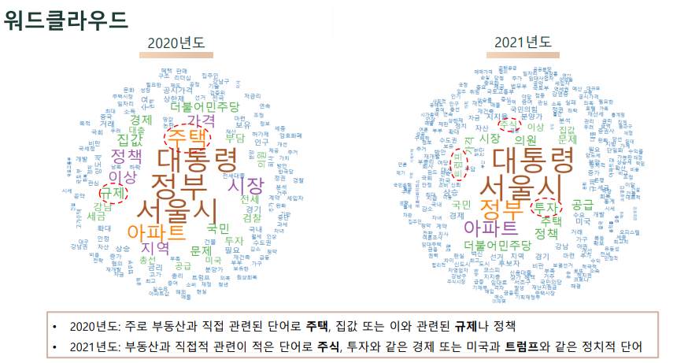
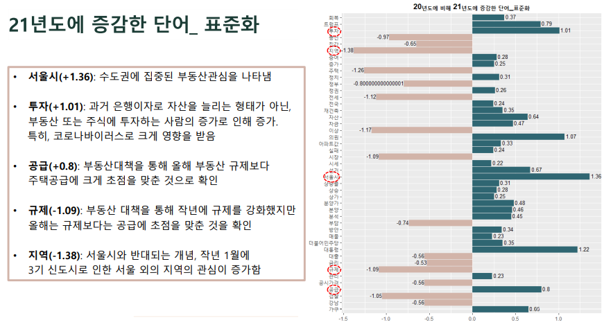

# project1_wordcloud
## R을 이용해 기사 수집 및 워드클라우드 진행
(중간 저장을 하지 못함)

## 목표
20년도 1월과 21년도 1월의 ‘부동산’에 대한 기사를 수집하여 그 차이를 비교 (`워드클라우드`를 진행)

## 설명
- 데이터 수집 및 분석
    - 20년도 1월과 21년도 1월의 ‘부동산’ 키위드의 기사 수집 (**20년도 300건, 21년도 399건**)
    - R을 이용해 스크래핑으로 수집
    - 기본적인 전처리(특수문자나 전화번호, 이메일 등 제거)를 실시하고 `두글자 이상의 명사`만 추출
    - 불용어를 제거하고 corpus화 시켜 정제시킴

- 결과
    - **워드클라우드**를 통해 비교 및 각 년도에 나오는 단어를 보고 비교
          
    - 또한 **표준화**를 취해 단위가 다른 각 년도의 데이터를 비교
    - 따라서 21년도에 `서울시`, `투자`, `공급`에 대한 언급이 늘고 `규제`, `지역`에 대한 언급이 줄어든 것을 확인, 또한 주택에 한정되어 있던 부동산은 `주식과 투자`라는 더 큰 규모로 변환한 것을 파악함
          

## 진행 인원
개인

## 이용 데이터
'중앙일보'에서 키워드 '부동산'으로 추출   
20년도 300건과 21년도 399건